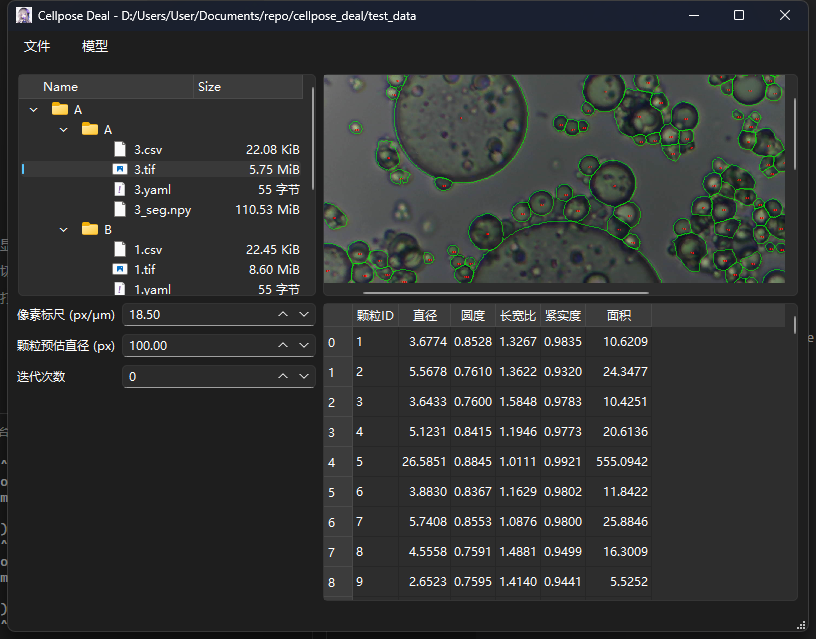

# Cellpose Deal - 细胞分割质检工具

基于 Cellpose 的桌面端图像分割与质检工具，为科研人员提供从原始图片批量处理、交互式审查到结构化数据导出的完整本地化工作流。

## 功能特性

- **批量处理**: 批量处理图像，支持推理单个/全部
- **交互审查**：文件树浏览，上一张/下一张快速浏览，调整推理参数，表格和图像高亮与删除
- **数据导出**：自动保存 npy、csv 和 yaml 文件，全部导出为 xlsx
- **快捷操作**：快捷键绑定，快速操作打开、推理、切换图片等



## 如何运行

### 环境要求

```txt
# 开发测试环境如下
Python 3.11

# 核心依赖
cellpose==4.1.0
PySide6==6.11.0
torch==2.11.0+cu128
torchvision==0.26.0+cu128
pandas==2.3.3
scikit-image==0.25.2
PyYAML==6.0.3
openpyxl==3.1.5

# 格式化
black==25.1.0

# 可选依赖，用于cellpose原生的GUI应用，或直接使用 pip install cellpose[gui]
QtPy==2.4.3
pyqtgraph==0.14.0
superqt==0.8.1
```

### 安装依赖

```bash
# 创建虚拟环境
python -m venv .venv
# 激活虚拟环境(后续都是在虚拟环境操作)
.venv\Scripts\activate     # Windows

# 安装依赖, 使用阿里云镜像的torch, 若无cuda手动安装CPU版的torch即可
pip install -r .\requirements.txt -f https://mirrors.aliyun.com/pytorch-wheels/cu128/
```

### 启动方式

- 命令启动(或使用vscode的launch和task启动)

```bash
# GUI
python setup.py build_ui
python src/main_gui.py
# CLI 已弃用
python src/main_cli.py
# cellpose 的 GUI
cellpose.exe
```
